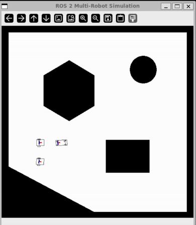

# ROS 2 Multi-Robot Task Simulation


A decentralized multi-robot simulation for dynamic task assignment in ROS 2 (Humble), using the Hungarian algorithm for optimal allocation and OpenCV for visualization.

---

## Demo Preview (示範成果)

**Demo Gif:**



- OpenCV 介面可動態新增任務
- 多台 robot_agent 自動競標並分配目標
- 軌跡平滑、路徑規劃與控制器皆可切換
- Arduino LED 顯示任務量、馬達隨機動作反映「是否有 robot 正在執行任務」

---

## Core Features (核心功能)

1.**動態任務分配**  
- 使用者可在 OpenCV 視窗內任意點擊新增任務。

2.**最佳化指派（Hungarian Algorithm）**  
- Leader agent 使用 `scipy.optimize.linear_sum_assignment` 進行最小成本最佳分配。

3.**分離式架構**  
- simulation_node — 中央視覺化 + 模擬伺服器  
- robot_agent — 分散式智慧體，每台機器人都獨立運算

4.**多種規劃器**  
- A*, RRT, RRT*

5.**多種控制器**  
- PID, LQR, Stanley (Bicycle Model), Pure Pursuit

6.**Arduino 硬體回饋**  
- LED → 顯示「剩餘 task 數量」  
- 馬達 → robot 有在動就跟著轉動

---

## System Architecture (系統架構)

1. **Simulation Node (顯示介面 + 伺服器)**
    - OpenCV 視窗顯示地圖、路徑、機器人位置
    - 負責生成 robot 物件及其模擬運動
    - 發布 `/task_list`、`/<robot>/pose`
    - 接收 `/assign_goal` → 派發給對應 robot
    - 可連接 Arduino 進行燈號與馬達控制

2. **Robot Agent (分散式智能體)**
    - 每啟動一個 robot，就會建立一個獨立 agent：
        - 訂閱 `/task_list` → 計算到每個任務的成本
        - 發布成本到 `/agent_reports`
        - 自動選出：ID 最小者為Leader
            - Leader 進行指派後發布 `/assign_goal`

---

## Directory Tree (專案包裹結構)
```
ros2_multi_robot_task_sim/src
│
├── multi_robot_sim/
│   ├── PathPlanning/
│   │   ├── planner_a_star.py
│   │   ├── planner_rrt.py
│   │   ├── planner_rrt_star.py
│   │   ├── cubic_spline.py
│   │   ├── planner.py
│   │   └── utils.py
│   │ 
│   ├── PathTracking/
│   │   ├── controller_pid_basic.py
│   │   ├── controller_pid_bicycle.py
│   │   ├── controller_pure_pursuit_bicycle.py
│   │   ├── controller_pure_pursuit_basic.py
│   │   ├── controller_stanley_bicycle.py
│   │   ├── controller_lqr_basic.py
│   │   ├── controller_lqr_bicycle.py
│   │   ├── controller.py
│   │   └── utils.py
│   │
│   ├── Simulation/
│   │   ├── simulator_basic.py
│   │   ├── simulator_differential_drive.py
│   │   ├── simulator_bicycle.py
│   │   ├── simulator_map_function.py
│   │   ├── simulator_map.py
│   │   ├── kinematic_basic.py
│   │   ├── kinematic_differential_drive.py
│   │   ├── kinematic_bicycle.py
│   │   ├── kinematic.py
│   │   ├── simulator_robot.py
│   │   ├── sensor_lidar.py
│   │   ├── simulator.py
│   │   └── utils.py
│   │
│   ├── robot_agent.py
│   ├── simulation_node.py
│   │
├── maps/
│   ├── map1.png
│   ├── map2.png
│   └── map3.png
│
├── launch/
│   ├── all_launch.py
│   ├── sim_launch.py
│   ├── robot1_launch.py
│   ├── robot2_launch.py
│   └── robot3_launch.py
│
├── package.xml
│
├── setup.cfg
│
├── setup.py
```

---

## Configurable Parameters (可調整參數)

以下示例來自 `robot1_launch.py`：

```python
parameters=[
    {'map': map_file},
    {'robot_name': 'robot_1'},
    {'init_pose': [100.0, 200.0, 0.0]},
    {'simulator_type': 'diff_drive'},
    {'controller_type': 'pid'},
    {'planner_type': 'a_star'}
]
```

| 參數名稱         | 功能               | 可用選項                       |
|------------------|--------------------|-------------------------------|
| robot_name       | 機器人 ID          | 任意字串                      |
| init_pose        | 初始位置 (x, y, yaw)| 浮點數陣列                    |
| simulator_type   | 使用的動力學模型   | basic, diff_drive, bicycle    |
| controller_type  | 路徑追蹤控制器     | pid, lqr, stanley, pure_pursuit|
| planner_type     | 路徑規劃演算法     | a_star, rrt, rrt_star         |
| map              | 使用地圖           | PNG 檔案路徑                  |

---

## 已知問題 / Notes

- 在樹梅派（Raspberry Pi）上執行時，模擬速度會明顯較慢，建議使用效能較佳的主機運行。
- LQR 控制器目前尚未最佳化，執行多次任務後可能出現「發瘋亂轉」的不可控的情況，建議測試時選用其他控制器（如 PID、Stanley、Pure Pursuit），或自行調整 `controller_lqr_<model>.py` 內的 LQR 演算法與參數。

---

## 安裝與執行

**需求：**
* ROS 2 Humble
* Python 3.10+
* OpenCV (`python3-opencv`)
* SciPy (`python3-scipy`)
* PySerial (`python3-serial`)

**1. 建立與編譯**

```bash
# 1. 切換到你想放置專案的資料夾
cd 

# 2. 下載專案原始碼
git clone https://github.com/rick55654/ros2_multi_robot_task_sim.git

# 3. 進入專案資料夾
cd ros2_multi_robot_task_sim

# 4. 編譯 multi_robot_sim 套件
colcon build --packages-select multi_robot_sim

# 5. 匯入 ROS 2 環境變數
source install/setup.bash
```
> 註：下載後可直接進入 `ros2_multi_robot_task_sim` 資料夾編譯，不需額外搬移或調整結構。

**2. 執行模擬**

開啟多個終端機。

```bash
# 終端機 1: 啟動Simulation Node 模擬器 (顯示介面)
source ~/ros2_multi_robot_task_sim/install/setup.bash
ros2 launch multi_robot_sim sim_launch.py
```
```bash
# 終端機 2: 啟動機器人 1
source ~/ros2_multi_robot_task_sim/install/setup.bash
ros2 launch multi_robot_sim robot1_launch.py
```
```bash
# 終端機 3: 啟動機器人 2
source ~/ros2_multi_robot_task_sim/install/setup.bash
ros2 launch multi_robot_sim robot2_launch.py
```
**3. 使用方式**
1. 啟動所有節點後，一個名為 "ROS 2 Multi-Robot Simulation" 的 OpenCV 視窗將會出現。
2. 在視窗的白色可通行區域內點擊滑鼠左鍵。
3. 每次點擊都會在 `/task_list `中新增一個任務。
4. 被選為的 Leader 將計算最佳分配，並派遣最合適的機器人前往執行。
5. (可選) 連接 Arduino，LED 燈將顯示待處理任務的數量.
